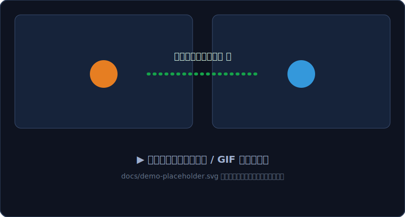
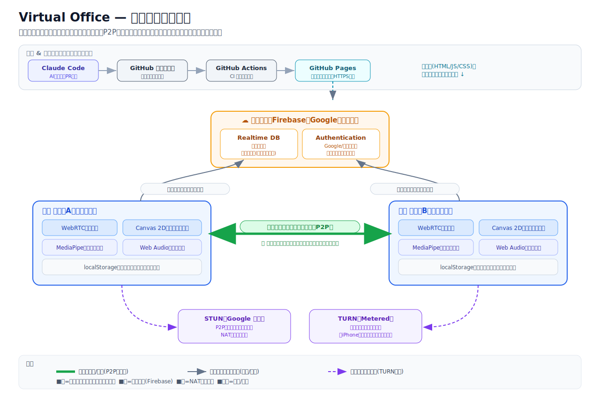

<!--
このファイルは Marp 形式のスライドです。
プレビュー/書き出し方法:
  - VS Code 拡張「Marp for VS Code」でプレビュー
  - もしくは CLI:  npx @marp-team/marp-cli docs/slides.md -o slides.pdf   (または --html)
各スライド末尾の <!-- ... -> は発表者ノート（話す用メモ）です。
-->

<!-- _class: lead -->
# 🏢 Virtual Office
## 近づくと、自然に話せる仮想オフィス

公開URL: https://tkris1012.github.io/virtual-office/ ／ QRはこちら

<!--
最初のつかみ。まず「何ができるか」を一言で。デモがあるなら「あとで実際に触ります」と予告。
-->

---

## これは何？

- Gather 風の **2Dマップ**を歩く仮想オフィス
- アバターに **近づくと自動でビデオ通話が始まり**、離れると切れる
- ブラウザだけで動く（インストール不要）／**ほぼ無料**の構成

> 「会議を予約して入る」ではなく、**すれ違って話す**を再現

<!--
Zoomとの違いは「入室のハードルが無い」こと。オフィスで席が近い人と自然に喋る感覚。
-->

---

## なぜ作った？ 🎯

- リモートで **会議は増えたのに、雑談が消えた**
- ちょっとした相談・雑談の「きっかけ」が生まれにくい
- → オフィスの **“すれ違いざまの一言”** をオンラインで取り戻したい

<!--
共感パート。聞き手の「あるある」を引き出す。課題→この後の解決につなげる。
-->

---

## デモ 🎥

<!-- ここにデモのスクリーンショット/GIFを差し込む（demo-placeholder.svg を差し替え）-->

- 2画面を並べ、アバターを **近づける → 通話開始**
- 離れる／退出 → **自動で切断**

<!--
ここが主役。実機 or 録画で見せる。画像は docs/ に demo-placeholder.png を置き換え。
-->

---

## 主な機能

| | |
|---|---|
| 🎙 近接通話・エリア通話 | 近づいた人／同じ会議室の人と自動通話 |
| 🖥 画面共有 | 資料や画面をその場で共有 |
| 🌫 背景ぼかし / 仮想背景 | 自宅の背景を隠せる（端末内処理） |
| 🦊 カスタムアバター | プリセット28種＋画像アップロード |
| 💬 ひとことメッセージ | 「集中中」などをアバター上に表示 |
| 🔔 アクティブ表示・通知音 | 在席状況・接近を音で気づける |
| 🎮 ミニゲーム | ゲームコーナーで「スライムたたき」 |

<!--
全部は語らず、代表的なものを2〜3個だけ口頭で補足すると良い。
-->

---

## 技術スタック 全体図 🗺

太い緑線＝映像/音声は<strong>利用者どうし直接(P2P)</strong>／細線＝位置合わせ・認証だけクラウド／破線＝必要時だけTURN中継

<!--
この1枚で設計思想を伝える。「クラウドは脇役、通話は本人同士」がポイント。
-->

---

## 仕組みのキモ ① 位置はクラウドで同期

- 各アバターの座標を **Firebase Realtime Database** で全員へ配信
- 動いている時だけ・間引いて送信 → **無料枠を節約**
- 「誰がどこにいるか」を全員がリアルタイムに共有

<!--
Firebaseは「変更が全端末に即反映されるDB」。位置と“通話の合図”に使う。
-->

---

## 仕組みのキモ ② 近づいた人とだけ P2P

- 映像・音声は **WebRTCで利用者どうし直接**やりとり（サーバー不経由）
- 「近接した相手とだけ繋ぐ」＝ **自然な負荷分散**
- だから **サーバー費用ほぼゼロ**で、多人数でも成立

<!--
ここが“無料で動く”核心。全員総当たりではなく周囲の数人だけ繋ぐ。
-->

---

## 各技術の役割（何 / なぜ）

| 技術 | 役割 | **なぜ必要** |
|---|---|---|
| GitHub Pages | 静的サイト公開 | **無料でHTTPS**（カメラはHTTPS必須） |
| Firebase RTDB | 位置同期・合図 | 全員へ**即同期**する土台 |
| Firebase Auth | ログイン | **本人確認**・設定の引き継ぎ |
| WebRTC (P2P) | 映像・音声 | **サーバー不要・低遅延** |
| STUN / TURN | 接続の補助 | 直結の道さがし／**繋がらない時だけ中継** |
| Canvas / MediaPipe / Web Audio | 描画・背景・音 | **端末内で完結**（追加費用なし） |

<!--
「なぜ必要」列だけ読むと納得感が出る。技術者以外にはここを丁寧に。
-->

---

<!-- _class: lead -->
# 🛠 開発ストーリー
## 躓き → 改善 → 学び

面白いのは「詰まって、どう抜けたか」

<!--
ここから後半。順調自慢ではなく“ハマりどころ”を共有するパート、と宣言。
-->

---

## 章2：“自分らしさ”を出す — アバター＋認証

やったこと：色付きの丸 → プリセット/画像アバター、匿名→Google/メール認証

- 🧱 躓き：画像用の **Firebase Storage が有料プラン必須**に
- 🔧 改善：Storageをやめ、画像を**圧縮してDBにdata URL保存** → 無料のまま実現
- 🧱 躓き：設定を保存して閉じると **アバター・名前が消える**
- 🔧 改善：失敗を**握りつぶさずトースト表示**＋端末に控え＋DBルール公開で解決
- 💡 学び：**エラーは“見える化”が最速のデバッグ**

<!--
共感度高め。特に「保存失敗を黙って捨てていた」話はウケる。
-->

---

## 章3：iPhoneで画面が真っ黒！ — TURN

やったこと：一部環境で映像が出ない問題への対応

- 🧱 躓き：社内Wi-Fi等で **P2P直結できず** iPhoneが黒画面
- 🔧 改善：**TURN（中継）** を導入。無料枠で、**直結できない時だけ**中継
- 💡 学び：**P2Pは万能じゃない。“必要な時だけ中継”が現実解**

<!--
「なぜ黒くなる？」→ ネットワークが直結を許さない環境がある、を平易に。
-->

---

## 章4：没入感を上げる — HUD自動表示/非表示

やったこと：ツールバー等を無操作で自動的に隠し、動かすと戻す

- 🔧 工夫：いきなり作らず **仕様を先にすり合わせ**
  （隠す対象／通話中はカメラを残す／タッチ誤爆を防ぐ 等）
- 💡 学び：**小さな体験こそ“事前の認識合わせ”が手戻りを防ぐ**

<!--
派手さは無いが「段取りの良さ」を示せる章。品質意識のアピール。
-->

---

## 章5：みんなで開発できる体制に 🤝

やったこと：外部からの貢献(PR)を安全に受ける仕組み（CI・レビュー）を整備

- 🧱 躓き：初の外部PRが **コンフリクト**（先にマージ済みの変更と重複）
- 🔧 改善：**最新へrebase（追従）** を依頼 → 重複が消えクリーンにマージ
- ✅ ここで **CIが自動で緑**になり、体制が機能した瞬間を確認
- 💡 学び：**“先にマージ済みへ追従”が基本。仕組み(CI)が安心を作る**

<!--
コンフリクトは開発者あるある。図で「古い枝から出すと衝突」を説明すると◎。
-->

---

## 章6：機能ラッシュ ⚡（AI × PRフロー）

やったこと：ひとこと／ツールチップ／ミニゲーム／通知音を高速追加

- 流れ：**AIが実装 → PR → CIで自動チェック → レビュー → 自動デプロイ**
- 🧱 躓き：本番へ即公開のため、**自動デプロイに安全ブレーキ**がかかった
- 🔧 改善：**“デプロイは明示承認してから”** の運用に
- 💡 学び：**自動化と安全確認はセット。速さと慎重さを両立**

<!--
AIエージェント開発の実例。速いが、危険な所は人が確認、という締め方。
-->

---

## この開発の学び 3つ 💡

1. **エラーは見える化** — 黙って捨てると詰みが長引く
2. **無料の壁は“設計の工夫”で越える** — Storage→data URL、TURNは必要時だけ
3. **速さは仕組みで支える** — CI＋レビュー＋明示デプロイで、AI高速開発でも壊れない

<!--
3つに絞って持ち帰ってもらう。ここが発表の“お土産”。
-->

---

<!-- _class: lead -->
## ありがとうございました 🙌

**触ってみてください** → https://tkris1012.github.io/virtual-office/

今後：テキストチャット・在席ステータス・マップ拡充 など

<!--
QRを貼るとその場で試してもらえる。質疑へ。
-->
